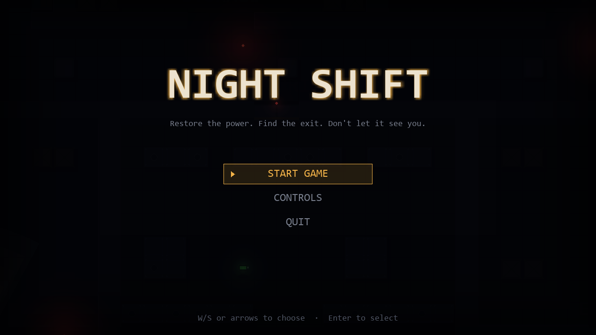
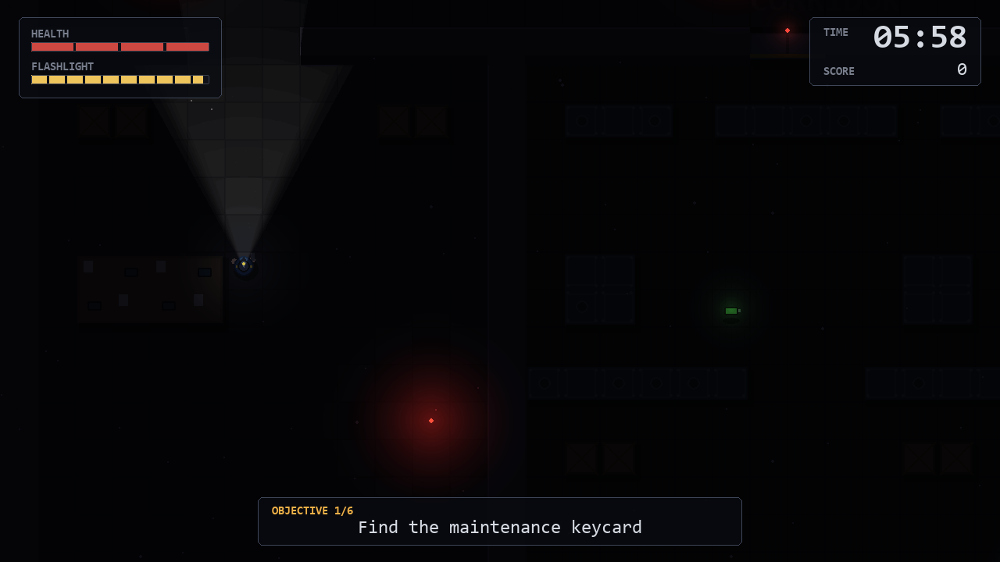
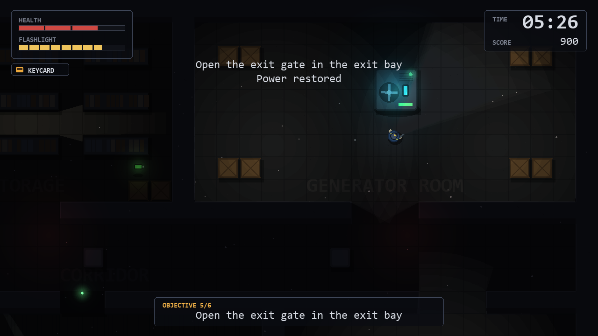

# Night Shift

A short top-down stealth game about the last shift in an abandoned facility. Find the
keycard, restore the power, and get out before the clock runs out — while something else
walks the corridors with you.

A run takes about five to ten minutes. Everything is drawn with Pygame primitives and
lighting; there are no external art or audio assets.

## Features

- Hand-built facility of eight connected areas: lobby, office, storage, corridor,
  maintenance, generator room, exit bay and loading dock
- Dynamic lighting with a wall-occluded flashlight beam, room lamps and emergency lights
- Limited flashlight energy: it drains while lit, trickles back while off, and batteries
  top it up — but a lit torch is seen from much further away
- One patrolling watcher with patrol, chase and search behaviour, line-of-sight detection
  and hearing
- Objective chain: keycard → locked door → fuse cell → generator → exit gate → escape
- Shift timer, scoring with a time bonus, damage penalties and an invulnerability window
- Particles, screen shake, vignettes, fade transitions and procedurally synthesised sound

## Screenshots

| Main menu | Exploring in the dark | Power restored |
| --- | --- | --- |
|  |  |  |

## Requirements

- Python 3.10 or newer
- Pygame 2.5 or newer (installed below)

## Installation

```bash
git clone https://github.com/hannaDesalegn/Night-Shift.git
cd Night-Shift
python -m venv .venv
# Windows
.venv\Scripts\activate
# macOS / Linux
source .venv/bin/activate
pip install -r requirements.txt
```

## Run

```bash
python main.py
```

The game runs fully offline. If no audio device is available it starts silently.

## Controls

| Key | Action |
| --- | --- |
| `W` `A` `S` `D` or arrow keys | Move |
| `E` | Interact with doors and the generator |
| `F` | Toggle the flashlight |
| `Esc` / `P` | Pause |
| `R` | Restart (while paused or after a run ends) |
| `Enter` | Confirm menu selection |

## Gameplay

You start in the lobby with a torch and six minutes. Search the offices for the
maintenance keycard, unlock the maintenance wing, and recover the generator fuse cell.
Install it in the generator room to bring the facility lights back on, which also powers
the exit gate in the exit bay. Open the gate and reach the loading dock to escape.

The watcher patrols a fixed route. It notices movement in its line of sight, hears you
from close by, and spots a lit flashlight from much further away. Once it loses you it
searches your last known position before returning to its route. It is slightly slower
than you are, so running is a real option — but each hit costs health, and four hits end
the shift. Points come from items, restoring power, escaping and the time you have left;
taking damage costs you.

## Project structure

```text
main.py            entry point
src/settings.py    all tuning values and colors
src/game.py        window, main loop and state machine
src/session.py     rules for a single run: objectives, interactions, scoring
src/world.py       map layout, tile collision, line of sight, pathfinding
src/player.py      movement, health, flashlight
src/enemy.py       patrol / chase / search state machine
src/entities.py    pickups, doors, generator
src/lighting.py    lightmap, occluded beams and point lights
src/renderer.py    facility art, actors, camera and scene assembly
src/hud.py         in-game HUD
src/ui.py          fonts, menus and full-screen screens
src/effects.py     particles, screen shake, vignettes, fades
src/audio.py       procedurally synthesised sound effects
tests/             unit and end-to-end tests
```

## Testing

```bash
pip install -r requirements-dev.txt
python -m pytest
```

The suite runs headless and covers collision, pathfinding, enemy perception, flashlight
energy, scoring, state transitions and a scripted end-to-end playthrough. Linting and
formatting use Ruff:

```bash
python -m ruff check .
python -m ruff format --check .
```

## License

Released under the MIT License. See [LICENSE](LICENSE).
